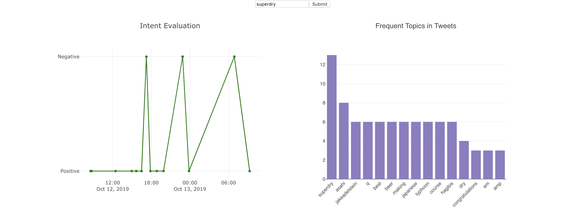

# Brand Evalautor
## About
Its a novel web application backed by deep learning model built to evaluate the presence of a brand on twitter by checking the sentiments of the people's
tweets and topic on which they are talking about. This can help the brands to evaluate the performance in real time for instance for their new product or campaign lauch this can help to generate marketing reports. 

## How to use it
The user need to type the name of the product or campaign in searchbar.

## check the app -  http://34.65.150.243/ 
It is deployed on google kubernetes cluster

## Technical Details
- Implemented Microservices architecture. It has four services each running as different docker container
  - Frontend 
  - Backend
  - Postgres
  - Pgadmin
- Frontend is built using create-react-pp
- Backend is built using FastApi. Here are some following features I implemented
    1. Both request and response are throughly validated.
    2. Project implements pydantic typing.
    3. Clean separation of environment variables.
    4. Results are saved in postgresDb
    5. Api source code - **/backend/src/app/api/**
-  Tweet Analyzer
    1. Implemented NLP sentiment analysis model using **Keras (/backend/src/app/ml_model_2)**
    2. Used NLTK for tweet analysis
    3. Used Twitter Api and tweepy libary to fetch the real time tweets.
    
## Development && Deployment
- Fully Dockerized envoirment for both development and production.
- Docker compose is used in the development to orchestrate microservices.
- Kubernetes is used to deploy the microservices on google cloud platform
- App is available at - http://34.65.150.243/ 
- Backend swagger docs at - http://34.65.245.120/docs
- Run docker-compose up to develop

## Future Work
- Add real time streaming using Kafka and process the tweets using pyspark.
-  Improve sentiment analysis model. I want to try few more model architectures like BILstm along with attention for catching up sarcasm. 
-  Perform context analysis by gathering more user related data.
-  Improve the UI by adding more intitutive plots.

